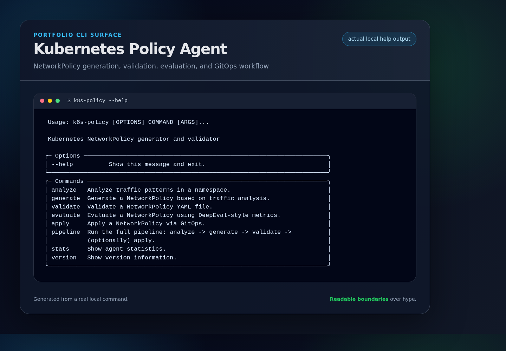
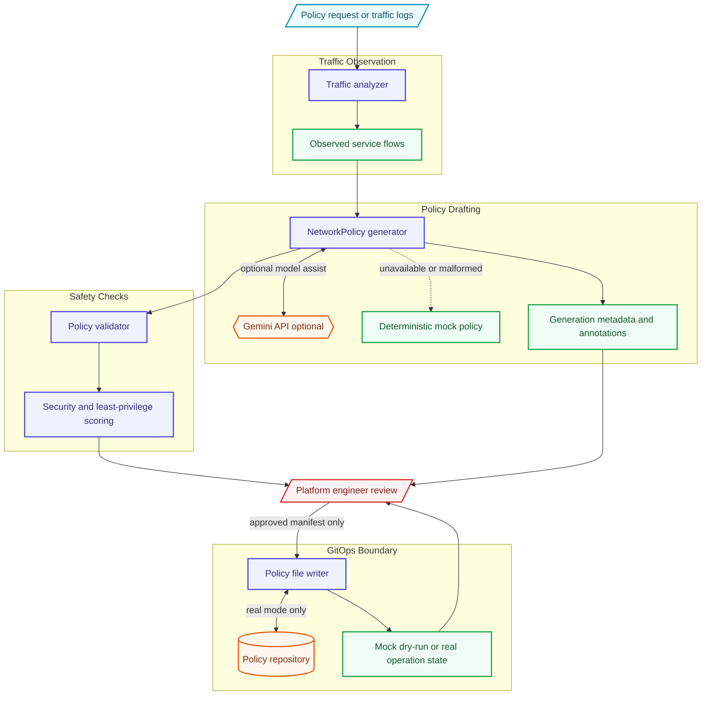

# Kubernetes Policy Agent

Kubernetes NetworkPolicy generator and validator with optional Gemini-assisted generation and deterministic mock behavior for demos and tests.

## Portfolio Showcase



- **Architecture deep dive:** [`docs/ARCHITECTURE.md`](docs/ARCHITECTURE.md)
- **Demo guide:** [`docs/DEMO.md`](docs/DEMO.md)
- **Reviewer focus:** traffic observation, Gemini-assisted NetworkPolicy drafts, validation, and GitOps dry-run/real boundaries.

## Architecture Overview



## Features

- **Traffic Analysis**: Analyze CNI (Cilium/Calico) logs to understand observed traffic patterns
- **Policy Generation**: Generate NetworkPolicies from observed traffic using Gemini when configured, or deterministic mock behavior for local demos/tests
- **Policy Validation**: Validate policies against security best practices
- **DeepEval Scoring**: Evaluate policies on security, completeness, and least-privilege metrics
- **GitOps Integration**: Write policy manifests to a Git repository workflow with explicit mock and dry-run boundaries

## What Works Today

- Generates Kubernetes `NetworkPolicy` manifests from policy requests and observed traffic data.
- Adds DNS egress rules in generated policies so common cluster name resolution remains visible.
- Validates generated or provided policies for common safety checks and recommendations.
- Evaluates policies with local scoring dimensions for security, completeness, and least privilege.
- Can write generated policy YAML into a Git-backed policy directory and report commit metadata.

## Current Limits

- Generated policies are starting points and require human review before production use.
- Traffic-derived policies only reflect the observations provided to the tool; missing traffic can produce incomplete allow rules.
- Gemini responses can be unavailable, malformed, or network-dependent. When that happens, generation falls back to deterministic mock behavior and marks the policy as degraded in metadata.
- The evaluator is a project-local scoring implementation; it is not a substitute for cluster-specific security review or admission testing.

## Dependency Behavior

- Gemini generation requires `K8S_POLICY_GEMINI_API_KEY`, the configured model name, and network access to Google Generative AI APIs.
- Mock mode is deterministic demo/test behavior. It does not call Gemini and should not be represented as externally inferred policy intelligence.
- Generated manifests include annotations for generation source, degradation status, model name when used, and generation errors when fallback was required.
- Kubernetes and Git operations depend on local credentials/configuration and should be validated in the target environment.

## GitOps/Safety Boundaries

- Dry-run mode is intended to make remote side effects explicit; pushes are skipped when dry-run is enabled.
- Mock GitOps mode uses a temporary local repository and labels returned commit metadata as mock behavior.
- Real GitOps push/apply flows need explicit care: review generated YAML, confirm the target branch/repository, and understand downstream controllers such as Argo CD or Flux before pushing.
- This project does not automatically prove a policy is safe for a live cluster. Treat generated policies as review artifacts.

## Installation

```bash
# Clone the repository
git clone https://github.com/lord-dubious/k8s-policy-agent.git
cd k8s-policy-agent

# Create virtual environment and install
uv venv
source .venv/bin/activate
uv pip install -e ".[dev]"
```

## Quick Start

### Analyze Traffic

```bash
# Analyze traffic in a namespace (mock mode for demo)
k8s-policy analyze default --mock

# Analyze specific pods
k8s-policy analyze production --labels app=backend --mock
```

### Generate Policies

```bash
# Generate policy based on traffic analysis using deterministic mock behavior
k8s-policy generate --mock

# Generate with pod labels
k8s-policy generate --labels app=backend,tier=api --mock

# Generate default-deny policy
k8s-policy generate --default-deny --mock

# Save to file
k8s-policy generate --output policy.yaml --mock
```

### Validate Policies

```bash
# Validate a policy file
k8s-policy validate policy.yaml

# Shows validation errors, warnings, and security checks
```

### Evaluate Policies

```bash
# Evaluate policy with DeepEval-style metrics
k8s-policy evaluate policy.yaml

# Shows:
# - Security Score
# - Completeness Score  
# - Least Privilege Score
# - Individual test results
```

### Full Pipeline

```bash
# Run full pipeline: analyze -> generate -> validate
k8s-policy pipeline default --mock

# Exercise the GitOps path without remote push/apply side effects
k8s-policy pipeline default --apply --mock --dry-run
```

## Configuration

Set environment variables or use `.env` file:

```bash
# Gemini API
K8S_POLICY_GEMINI_API_KEY=your-api-key
K8S_POLICY_GEMINI_MODEL=gemini-2.0-flash

# Kubernetes
K8S_POLICY_KUBECONFIG=/path/to/kubeconfig
K8S_POLICY_NAMESPACE=default

# GitOps
K8S_POLICY_GIT_REPO_URL=https://github.com/org/policies.git
K8S_POLICY_GIT_BRANCH=main
K8S_POLICY_GIT_POLICIES_PATH=policies/

# Behavior
K8S_POLICY_DRY_RUN=true
K8S_POLICY_MOCK_MODE=false
K8S_POLICY_AUTO_APPROVE=false
```

## Python API

```python
import asyncio
from k8s_policy_agent import create_policy_agent, create_config

async def main():
    # Create agent with config
    config = create_config(
        gemini_api_key="your-key",
        mock_mode=True,
    )
    agent = create_policy_agent(config)
    
    # Analyze and generate policy; review before applying to a cluster
    policy = await agent.analyze_and_generate(
        namespace="production",
        pod_labels={"app": "backend"},
    )
    
    # Validate
    validation = agent.validate(policy)
    print(f"Valid: {validation.is_valid}")
    
    # Evaluate
    evaluation = agent.evaluate(policy)
    print(f"Score: {evaluation.score:.2%}")
    
    # Get YAML
    yaml_content = agent.policy_generator.policy_to_yaml(policy)
    print(yaml_content)
    
    await agent.cleanup()

asyncio.run(main())
```

## Security Tests

The evaluator runs these security tests on each policy:

| Test | Description |
|------|-------------|
| `dns_egress` | Policy allows DNS egress to kube-system |
| `no_allow_all_ingress` | Policy doesn't allow all ingress traffic |
| `no_allow_all_egress` | Policy doesn't allow all egress traffic |
| `has_pod_selector` | Policy targets specific pods |
| `has_policy_types` | Policy specifies Ingress/Egress types |

## Development

```bash
# Run tests
pytest

# Run with coverage
pytest --cov=k8s_policy_agent

# Type checking
mypy src/

# Linting
ruff check src/ tests/
ruff format src/ tests/
```

## License

MIT License - see [LICENSE](LICENSE) for details.
