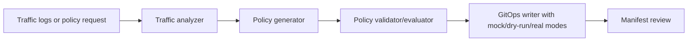

# Architecture

NetworkPolicy generation and validation workflow for Kubernetes traffic observations, with Gemini-assisted drafts, deterministic mock mode, and GitOps safety metadata.

This document is written for reviewers who want to understand how the project is shaped before reading the code. It emphasizes boundaries, dependencies, and degraded paths rather than marketing claims.

## Data Flow

1. Traffic logs or policy request
2. Traffic analyzer
3. Policy generator
4. Policy validator/evaluator
5. GitOps writer with mock/dry-run/real modes
6. Manifest review

## Main Components

- **Traffic analyzer**: Normalizes observed service-to-service flows.
- **Policy generator**: Builds NetworkPolicy YAML and annotates generation source/degraded state.
- **Policy validator**: Checks generated or provided policies against common safety expectations.
- **GitOps manager**: Writes policy manifests while reporting dry-run, mock, and real operation state.

## External Dependencies

- Python 3.11+
- Optional Gemini API key
- Optional Git repository for GitOps output
- Kubernetes cluster knowledge for production review

The project is intentionally explicit about optional services. Mock, fallback, and degraded paths are labeled in result metadata so a demo cannot be mistaken for a successful production integration.

## Failure And Degraded Modes

- External-service failures are captured as warnings, status fields, or source metadata where the domain model supports it.
- Mock/demo behavior is opt-in or explicitly labeled.
- Generated outputs are treated as review candidates, not authoritative decisions.
- CLI output remains user-facing; library internals use logging or structured metadata.

## What To Review In Code

- Generated manifests include generation-source and degraded annotations.
- GitOps push behavior is explicit about mock, dry-run, and real side effects.
- Tests cover fallback metadata and policy safety checks.

## Current Limits

- Generated policies need human review before applying to a cluster.
- Observed traffic can be incomplete and may produce overly narrow policies.
- Gemini assistance is optional and failures degrade visibly.
